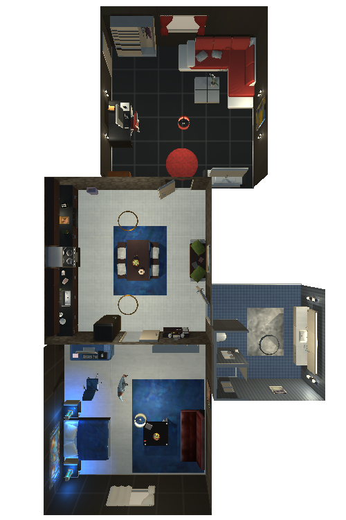
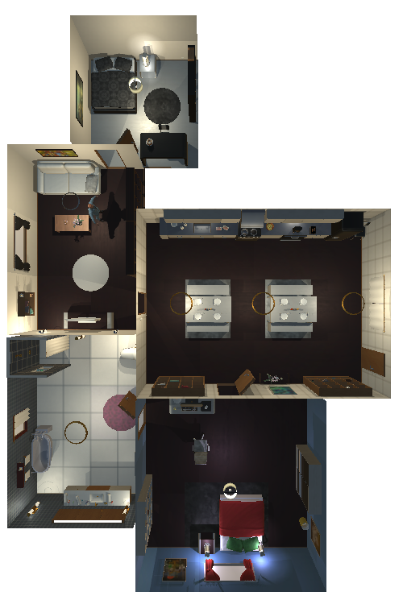
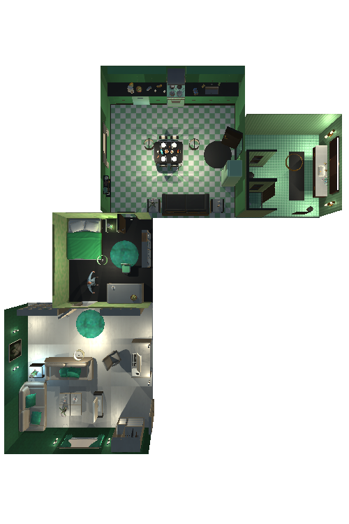

# VirtualHome
VirtualHome is a platform to simulate complex household activities via Programs. 
Given an initial environment describing an apartment and a program depicting a sequence of actions, 
VirtualHome executes the program generating a video of the activity together with useful data for activity understanding or planning.

Check out more details of the environmnent and platform in [VirtualHome](http://virtual-home.org). 

**PUT A GIF, PROBABLY A VIDEO WITH A MAN WATCHING TV WITH A CUTE CAT**


## Cite VirtualHome

VirtualHome has been used in:

- VirtualHome: Simulating HouseHold Activities via Programs, CVPR2018
- Synthesizing Environment-Aware Activities via Activity Sketches, CVPR2019


```
@inproceedings{puig2018virtualhome,
  title={Virtualhome: Simulating household activities via programs},
  author={Puig, Xavier and Ra, Kevin and Boben, Marko and Li, Jiaman and Wang, Tingwu and Fidler, Sanja and Torralba, Antonio},
  booktitle={Proceedings of the IEEE Conference on Computer Vision and Pattern Recognition},
  pages={8494--8502},
  year={2018}
}
```

```
@inproceedings{puig2018virtualhome,
  title={Virtualhome: Simulating household activities via programs},
  author={Puig, Xavier and Ra, Kevin and Boben, Marko and Li, Jiaman and Wang, Tingwu and Fidler, Sanja and Torralba, Antonio},
  booktitle={Proceedings of the IEEE Conference on Computer Vision and Pattern Recognition},
  pages={8494--8502},
  year={2018}
}
```

## Contents

- Motivation
- Dataset 
- Installation
- QuickStart
- Generating Videos/Keyframes
- Scripts Augmentation
- Other details

## Motivation

Among lots of simulator aiming at interacting with environments, why does virtualhome stand out? 
(can be that we focus on high-level action, including watching, ... etc.)

## Dataset

We collected a dataset of programs to execute in the environment. You can download them in [link to programs](). 
Once downloaded, move programs into the `data` folder. The data should follow the following structure:

```
data
└── programs_processed_precond_nograb_morepreconds
	|── initstate
	├── withoutconds
	├── executable_programs
	|   ├── TrimmedTestScene7_graph
	|	└── ...
	└── state_list
		├── TrimmedTestScene7_graph
	   	└── ...	
```

Where `withoutconds` and `initstate` contain the original programs and pre-conditions. 

To view a script executed in an enviornment, check `executable_programs/{environment}/{script_name}.txt`. 

To view the graph of the environment throughout the script execution of a program, check   `state_list/{environment}/{script_name}.json`.


## Installation

How to install the executable or run the code in Unity
### Step 1
Download the virtualhome simulator [here]()

### Step 2

Clone this repository
```bash
git clone https://mboben@bitbucket.org//virtualhome.git
# and maybe some basic setup
# and download the original scripts
```

### Step 3


## QuickStart

Run `sh run_example.sh` and you will get an activity video of this [scripts](example_scripts/...). 
You can check more example activity videos [here]().

For more details, see `example.py` file and there are some example scripts in `example_scripts` folder


## Genrating Videos/Keyframes

VirtualHome allows generating videos corresponding to an activity and keyframes corresponding to a snapshot of the environment state.


### Generate videos


If you want to generate the videos of the given scripts, 
```bash
```

### Generate keyframes

If you want to generate the keyframes of the given scripts, 
```bash
# commands of generating keyframes
```

## Scripts Augmentation


In *Synthesizing Environment-Aware Activities via Activity Sketches*, 
we augment the scripts with two knowledge base `KB-RealEnv` and `KB-ExceptonHandler`.
You can download the augmented scripts [here]().

Here, we provide the code to augment the sripts:

### Augment with `KB-RealEnv`

```bash
python ????.py --file_path ....
```


### Augment with `KB-ExceptionHandler`

```bash
python ????.py --file_path ....
```

## Other Details

We show the explanation of the format of the resources file in [resources/README.md](resources/README.md).

We show ....


## Environment
VirtualHome is composed of 7 scenes where activities can be executed. Each scene is encoded in a .json file containing a node for every object and edges between them representing relationships. They can be modified through the corresponding json file. 

The files representing each apartment can be found in `example_graphs`. 

Check `example_scripts/` for examples on how to read and update graphs.

| Scene 1   | Scene 2   | Scene 3   | Scene 4   | Scene 5   | Scene 6   | Scene 7  |
| ------------- | ------------- | ------------- | ------------- | ------------- | ------------- |------------- |
|  | | | | | | 


## Programs
Activities in VirtualHome are executed through programs. Each program is a sequence of instructions representing atomic actions that the agent will execute. Each program is stored in a .txt file with the following format. 

```
Program title
Program description


[ACTION_NAME] arg1 arg2
[ACTION_NAME] arg1 arg2
...
```
Where each argument has the format `<OBJECT_NAME> (ID_OBJECT)`. The number of arguments depends on the action type. The programs can also have a precondition file, specifying the state of the objects before the program is executed.

You can view the supported actions, objects and preconditions in [Resources]().


### Script generation
A program can be executed in multiple scenes. Depending on the scene where the script is executed, it will be matched to different objects and generate a different sequence of graphs. To execute a script in a given scene, run:

```

```


### Script augmentation

The original programs can be extended by replacing objects or perturbating the environment. You can find more details about how it is extended in [our paper](). To augment the dataset run.

```
cd dataset_generation
python augment_dataset_affordances.py
python augment_dataset_locations.py

```  


## Videos and Frames
VirtualHome allows generating videos corresponding to an activity and frames corresponding to a snapshot of the environment state.

### Generating videos

The following files will be generated

Check [examples](#Examples) for more details

### Frames
 

## Resources
Contains resource files used to initialize the environment, set properties of objects and generate videos given the scripts. Check the folder for a description of its contents.

