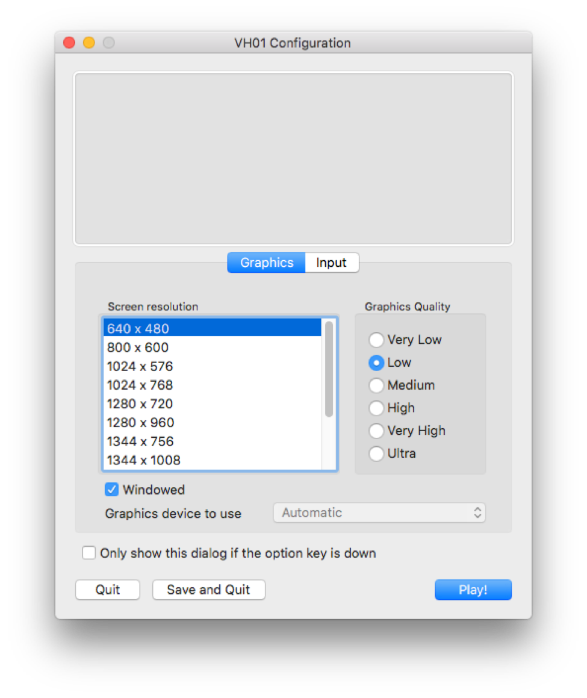

# VirtualHome
VirtualHome is a platform to simulate complex household activities via programs. Key aspect of VirtualHome is that it allows complex interactions with the environment, such as picking up objects, switching on/off appliances, opening appliances, etc. Our simulator can easily be called with a Python API: write the activity as a simple sequence of instructions which then get rendered in VirtualHome. You can choose between different agents and environments, as well as modify environments on the fly. You can also stream different ground-truth such as time-stamped actions, instance/semantic segmentation, and optical flow and depth. Check out more details of the environmnent and platform in [www.virtual-home.org](http://virtual-home.org). 

<p align="center">
  
</p>

## Cite VirtualHome

VirtualHome has been used in:

- VirtualHome: Simulating HouseHold Activities via Programs. [PDF](https://arxiv.org/pdf/1806.07011.pdf) <br/>
X. Puig*, K. Ra*, M. Boben*, J. Li, T. Wang, S. Fidler, A. Torralba.<br/>
CVPR2018.


- Synthesizing Environment-Aware Activities via Activity Sketches.<br/>
A. Liao*, X. Puig*, M. Boben, A. Torralba, S. Fidler.<br/>
CVPR2019.

If you plan to use the simulator, please consider citing them.

```
@inproceedings{puig2018virtualhome,
  title={Virtualhome: Simulating household activities via programs},
  author={Puig, Xavier and Ra, Kevin and Boben, Marko and Li, Jiaman and Wang, Tingwu and Fidler, Sanja and Torralba, Antonio},
  booktitle={Proceedings of the IEEE Conference on Computer Vision and Pattern Recognition},
  pages={8494--8502},
  year={2018}
}
```

```
@InProceedings{Liao_2019_CVPR,
author = {Liao, Yuan-Hong and Puig, Xavier and Boben, Marko and Torralba, Antonio and Fidler, Sanja},
title = {Synthesizing Environment-Aware Activities via Activity Sketches},
booktitle = {The IEEE Conference on Computer Vision and Pattern Recognition (CVPR)},
month = {June},
year = {2019}
}
```

## Contents

- Overview
- Set Up
- Generating Videos/Keyframes
- Dataset 
- Script Augmentation
- Other details


## Overview
Activities in VirtualHome are represented through two components: *programs* representing the sequence of actions that compose an activity, and *graphs* representing a definition of the environment where the activity takes place. Given a program and a graph, the simulator executes the program, generating a video of the activity or a sequence of graphs representing how the environment evolves as the activity takes place. To this end, VirtualHome includes two simulators: the *Unity Simulator* and *Evolving Graph*.

#### Unity Simulator 
This simulator is built in Unity and allows generating videos of activities. To use this simulator, you will need to download the appropiate executable and run it with the [Python API](simulation/unity_simulator/). You can check a demo of the simulator in [demo/unity_demo.ipynb](demo/unity_demo.ipynb)

#### Evolving Graph
This simulator runs fully in python and allows to generate a sequence of graphs when a program is executed. You can run it in [simulation/evolving_graph](simulation/evolving_graph). Note that some of the objects and actions in this simulator are not supported yet in Unity Simulator.


## Set Up


### Clone repository and install the dependencies
Note that this code base is based on Python 3
```bash
git clone https://github.com/xavierpuigf/virtualhome.git
pip install -r requirements.txt
```
We also provide a [Jupyter](https://jupyter.org/) notebook with a demo and starting code. If you want to run the demo, [install Jupyter](https://jupyter.org/install.html) and run it on your host. If you are new to Jupyter, see [Running the Jupyter Notebook](https://jupyter-notebook-beginner-guide.readthedocs.io/en/latest/execute.html) for a walkthrough of how to use this tool.

### Download Unity Simulator
Download the VirtualHome UnitySimulator executable and move it under `simulation/unity_simulator`.

- [Download](http://virtual-home.org/release/simulator/linux_sim.zip) Linux x86-64 version.
- [Download](http://virtual-home.org/release/simulator/mac_sim.zip) Mac OS X version.
- [Download](http://virtual-home.org/release/simulator/windows_sim.zip) Windows version.

You can also download the simulator, unzip it and move it under the `simulation` folder by running

```bash
./helper_scripts/download_sim.sh
```


### Test simulator

To test the simulator in the local machine, double click the executable, select a resolution and screen size and press `Play!`. Remember to select the option `Windowed` to make sure the simulator does not take the whole screen. The screenshot below shows our recommended configuration.




Once the simulator is started, run the demo in [demo/unity_demo.ipynb](demo/unity_demo.ipynb). 

If you do not have a monitor or want to test the simulator remotely, you can either use [Docker](docker) or use an X server, following [this medium post](https://towardsdatascience.com/how-to-run-unity-on-amazon-cloud-or-without-monitor-3c10ce022639). When running the executable with an X server, use -batchmode. For Linux, that would be:

```bash
sudo /usr/bin/X $display_num &
DISPLAY=:display_num ./$PATH_SIM/synvid.x86_64 -batchmode
```

You can also test the Evolving Graph simulator in [demo/example.py](demo/example.py). This simulator does not require opening any executable if you do not plan to generate images.

### Docker
You can also run Unity Simulator using Docker. You can find how to set it up [here](docker).


## Generating Videos and Snapshots

VirtualHome *Unity Simulator* allows generating videos corresponding to household activities. In addition, it is possible to use *Evolving Graph* simulator to obtain the environment for each execution step and use *UnitySimulator* to generate snapshots of the environment at each step.


### Generate videos

Open the simulator and run:

```bash
cd demo/
python generate_video.py
```


### Generate snapshots

Open the simulator and run:

```bash
cd demo/
python generate_snapshots.py
```
A grid of snapshots for the given script will be generated and saved in [demo/snapshot_test.png](demo/snapshot_test.png).

## Dataset

We collected a dataset of programs and augmented them with graphs using the Evolving Graph simulator. You can download them [here](http://virtual-home.org/release/programs/programs_processed_precond_nograb_morepreconds.zip). 
Once downloaded and unzipped, move the programs into the `dataset` folder. You can do all this by executing the script
```bash
./helper_scripts/download_dataset.sh
```
The dataset should follow the following structure:

```
dataset
└── programs_processed_precond_nograb_morepreconds
	|── initstate
	├── withoutconds
	├── executable_programs
	|   ├── TrimmedTestScene7_graph
	|	└── ...
	└── state_list
		├── TrimmedTestScene7_graph
	   	└── ...	
```

The folders `withoutconds` and `initstate` contain the original programs and pre-conditions. 

When a script is executed in an environment, the script changes by aligning the original objects with instances in the environment. You can view the resulting script in `executable_programs/{environment}/{script_name}.txt`.

To view the graph of the environment, and how it changes throughout the script execution of a program, check   `state_list/{environment}/{script_name}.json`.

You can find more details of the programs and environment graphs in [dataset/README.md](dataset/README.md).

## Script Augmentation


In *Synthesizing Environment-Aware Activities via Activity Sketches*, 
we augment the scripts with two knowledge bases: `KB-RealEnv` and `KB-ExceptonHandler`.
You can download the augmented scripts in [KB-RealEnv](http://virtual-home.org/release/programs/augment_location.zip) and [KB-ExceptionHandler](http://virtual-home.org/release/programs/augment_exception.zip).

Here, we provide the code to augment the sripts:

### Augment with `KB-RealEnv`

```bash
cd dataset_utils
python augment_dataset_locations.py
```


### Augment with `KB-ExceptionHandler`

```bash
cd dataset_utils
python augment_dataset_exceptions.py
```

## Resources

To do the above generation and augmentation, some valuable resource files are used to set the properties of objects, set the affordance of objects, etc.
Check [resources/README.md](resources/README.md) for more details.

## Contributors
- Marko Boben
- Xavier Puig
- Kevin Ra
- Andrew Liao


