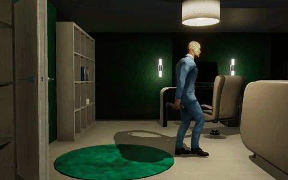

<div align="center">

[](http://virtual-home.org/documentation/)
[](https://discord.gg/JmzDYF3)
[](https://colab.research.google.com/github/xavierpuigf/virtualhome/blob/master/demo/unity_demo.ipynb)
[](https://pypi.org/project/virtualhome/)

# VirtualHome

**VirtualHome** is an interactive platform to simulate complex household activities via programs. Key aspect of VirtualHome is that it allows complex interactions with the environment, such as picking up objects, switching on/off appliances, opening appliances, etc. Our simulator can easily be called with a Python API: write the activity as a simple sequence of instructions which then get rendered in VirtualHome. You can choose between different agents and environments, as well as modify environments on the fly. You can also stream different ground-truth such as time-stamped actions, instance/semantic segmentation, and optical flow and depth. The platform allows to simulate multi-agent activities and can serve as an environment to train agents for embodied AI tasks.

Check out more details of the environmnent and platform at [**virtual-home.org**](http://virtual-home.org). 

<p align="center">
  
</p>

</div>

______________________________________________________________________

## What is New

VirtualHome 2.3 is out! Here are the latest updates:

* Added Procedural Generation Capabilities to allow agents to explore a infinite possibility of unique environments!  
* We added more custom designed environments!
* Enhanced simulated physics with the environments
* Time management system with synchronized day/night
* New outdoor terrain with accurate sunlight/shadows
* Improved indoor realtime lighting
* More realistic rooms
* Significant performance enhancements, asset optimizations, stability improvements
* Updated documentation
* General bug fixes for existing environments

### Past updates
* [August 2020] Added RL Environment Demo, and example to combine Environments with Ray.
* [April 2020] We added new documentation! Check it out at http://virtual-home.org/documentation
* We include OpenAI Gym like environments to train RL agents with VirtualHome. Check out the unity_environment.py class.
* API to add characters in the scene and fixed cameras, and record from those cameras


### Currently in Development

* Enhancements for Procedural Generation Capabilities
* Photorealism capabilities  
* More actions and object interactions
* Human interaction

____________________________________________________________

## Contents

1. Overview
2. Set Up
3. Generating Videos/Keyframes
4. VirtualHome RL Env
5. Dataset 
6. Modify VirtualHome
7. Citation
8. Contributors

______________________________________________________________________

## Overview

Activities in VirtualHome are represented through two components: *programs* representing the sequence of actions that compose an activity, and *graphs* representing a definition of the environment where the activity takes place. Given a program and a graph, the simulator executes the program, generating a video of the activity or a sequence of graphs representing how the environment evolves as the activity takes place. To this end, VirtualHome includes two simulators: the *Unity Simulator* and *Evolving Graph*. You can find a more complete documentation with examples and the different executables at http://virtual-home.org/documentation.

#### Unity Simulator 

This simulator is built in Unity and allows generating videos of activities. To use this simulator, you will need to download the appropiate executable and run it with the [Python API](virtualhome/simulation/unity_simulator/). You can check a demo of the simulator in [demo/unity_demo.ipynb](virtualhome/demo/unity_demo.ipynb)

#### Evolving Graph

This simulator runs fully in python and allows to generate a sequence of graphs when a program is executed. You can run it in [simulation/evolving_graph](virtualhome/simulation/evolving_graph). Note that some of the objects and actions in this simulator are not supported yet in Unity Simulator.

______________________________________________________________________

## Set Up

### Install

```bash
$ pip install virtualhome
```

We also provide a [Jupyter](https://jupyter.org/) notebook with a demo and starting code. If you want to run the demo, [install Jupyter](https://jupyter.org/install.html) and run it on your host. If you are new to Jupyter, see [Running the Jupyter Notebook](https://jupyter-notebook-beginner-guide.readthedocs.io/en/latest/execute.html) for a walkthrough of how to use this tool.


### Download Unity Simulator

Download the VirtualHome UnitySimulator executable and move it under `simulation/unity_simulator`.

- [Download](http://virtual-home.org//release/simulator/v2.0/v2.3.0/linux_exec.zip) Linux x86-64 version.
- [Download](http://virtual-home.org/release/simulator/v2.0/v2.3.0/macos_exec.zip) Mac OS X version.
- [Download](http://virtual-home.org//release/simulator/v2.0/v2.3.0/windows_exec.zip) Windows version.


### Test simulator

To test the simulator in a local machine, double click the executable, or run it via terminal. When running it via the temrinal, we recommend setting windowed mode (so that the simulator does not take the full screen), as such:

```bash
./path_to_exec -screen-fullscreen 0 -screen-quality 4 
```

Once the simulator has started, run the demo in [demo/unity_demo.ipynb](virtualhome/demo/unity_demo.ipynb). 

If you do not have a monitor or want to test the simulator remotely, you can either use [Docker](docker) or use an X server (find the installation instructions in [this medium post](https://towardsdatascience.com/how-to-run-unity-on-amazon-cloud-or-without-monitor-3c10ce022639)). When running the executable with an X server, use -batchmode. For Linux, you would do:

First run the X server on a terminal. You will have to specify which display you want to use, and on which GPUs. By default it will use all the gpus available
```bash
sudo python helper_scripts/startx.py $display_num
```

On a separate terminal, launch the executable
```bash
DISPLAY=:display_num ./{path_sim}/{exec_file}.x86_64 -batchmode
```

For Linux, you can also launch the UnityCommunication specifying an executable file. This will directly open the executable on the right sceen. You can do it as follows:

After running the X server, run:
```python
from simulation.unity_simulator import comm_unity
comm = comm_unity.UnityCommunication(file_name=file_name, port={your_port}, x_display={your_display})
```
It will open an executable and create a communication object to render scripts or simulate actvities. You can open multiple executables at the same time, to train models or generate data using multiple processes.

### Docker
You can also run Unity Simulator using Docker. You can find how to set it up [here](docker).

______________________________________________________________________

## Generating Videos and Snapshots

VirtualHome *Unity Simulator* allows generating videos corresponding to household activities. In addition, it is possible to use *Evolving Graph* simulator to obtain the environment for each execution step and use *UnitySimulator* to generate snapshots of the environment at each step.


### Generate videos

Open the simulator and run:

```bash
cd demo/
python generate_video.py
```


### Generate snapshots

Open the simulator and run:

```bash
cd demo/
python generate_snapshots.py
```
A grid of snapshots for the given script will be generated and saved in [demo/snapshot_test.png](virtualhome/demo/snapshot_test.png).

______________________________________________________________________

## VirtualHome RL Env

VirtualHome can be used as an environment for Reinforcement Learning. We provide a base class `UnityEnvironment` in [simulation/environment/unity_environment.py](virtualhome/simulation/environment/unity_environment.py). You can test how the class works by running

```bash
cd demo
python test_unity_environment.py
```

The provided environment can be combined with [Ray](https://github.com/ray-project/ray), to run multiple environments in parallel, allowing to scale your Reinforcement Learning algorithms. You can test parallel environments by running:

```bash
cd demo
python test_unity_environment_mp.py
```

______________________________________________________________________

## Dataset

We collected a dataset of programs and augmented them with graphs using the Evolving Graph simulator. You can download them [here](http://virtual-home.org/release/programs/programs_processed_precond_nograb_morepreconds.zip). 
Once downloaded and unzipped, move the programs into the `dataset` folder. You can do all this by executing the script
```bash
./helper_scripts/download_dataset.sh
```
The dataset should follow the following structure:

```
dataset
└── programs_processed_precond_nograb_morepreconds
	|── initstate
	├── withoutconds
	├── executable_programs
	|   ├── TrimmedTestScene7_graph
	|	└── ...
	└── state_list
		├── TrimmedTestScene7_graph
	   	└── ...	
```

The folders `withoutconds` and `initstate` contain the original programs and pre-conditions. 

When a script is executed in an environment, the script changes by aligning the original objects with instances in the environment. You can view the resulting script in `executable_programs/{environment}/{script_name}.txt`.

To view the graph of the environment, and how it changes throughout the script execution of a program, check   `state_list/{environment}/{script_name}.json`.

You can find more details of the programs and environment graphs in [dataset/README.md](virtualhome/dataset/README.md).


### Script Augmentation

In *Synthesizing Environment-Aware Activities via Activity Sketches*, 
we augment the scripts with two knowledge bases: `KB-RealEnv` and `KB-ExceptonHandler`.
You can download the augmented scripts in [KB-RealEnv](http://virtual-home.org/release/programs/augment_location.zip) and [KB-ExceptionHandler](http://virtual-home.org/release/programs/augment_exception.zip).

Here, we provide the code to augment the sripts:


#### Augment with `KB-RealEnv`

```bash
cd dataset_utils
python augment_dataset_locations.py
```


#### Augment with `KB-ExceptionHandler`

```bash
cd dataset_utils
python augment_dataset_exceptions.py
```


### Original Collected and Scripted Programs

We originally collected a set of programs to predict from language descriptions, and generated a larger of programs via a scripted language. Those programs are described [here](http://virtual-home.org/paper/virtualhome.pdf) as VirtualHome Activity (collected programs) ActivityPrograms (scripted programs). You can download them here:

- [Download](http://virtual-home.org/release/programs/virtualhome_cvpr18/real.zip) VirtualHome Activity.
- [Download](http://virtual-home.org/release/programs/virtualhome_cvpr18/synthetic.zip) ActivityPrograms.


### Resources

To do the above generation and augmentation, some valuable resource files are used to set the properties of objects, set the affordance of objects, etc.
Check [resources/README.md](virtualhome/resources/README.md) for more details.

______________________________________________________________________

## Documentation

To learn more about VirtualHome, please check out [VirtualHome Docs](http://virtual-home.org/documentation/).

______________________________________________________________________


## Modify VirtualHome

If you would like to contribute to VirtualHome, or modify the simulator for your research needs. Check out the repository with the [Unity Source Code](https://github.com/xavierpuigf/virtualhome_unity). You will need to download the Unity Editor and build your own executable after having made the updates.

<p align="center">
  
</p>

______________________________________________________________________

## Citation

VirtualHome has been used in:

- VirtualHome: Simulating HouseHold Activities via Programs. [PDF](https://arxiv.org/pdf/1806.07011.pdf) <br/>
X. Puig*, K. Ra*, M. Boben*, J. Li, T. Wang, S. Fidler, A. Torralba.<br/>
CVPR2018.


- Synthesizing Environment-Aware Activities via Activity Sketches.<br/>
A. Liao*, X. Puig*, M. Boben, A. Torralba, S. Fidler.<br/>
CVPR2019.


- Watch-and-Help: A Challenge for Social Perception and Human-AI Collaboration.<br/>
X. Puig, T. Shu, S. Li, Z. Wang, J. Tenenbaum, S. Fidler, A. Torralba.<br/>
ICLR2021, spotlight.<br/>
NeurIPS Cooperative AI Workshop 2020, Best Paper Award.

- Pre-Trained Language Models for Interactive Decision-Making. [Project](https://shuangli-project.github.io/Pre-Trained-Language-Models-for-Interactive-Decision-Making/) | [PDF](https://arxiv.org/pdf/2202.01771.pdf)<br/>
S. Li, X. Puig, C. Paxton, Y. Du, C. Wang, L. Fan, T. Chen, D. Huang, E. Akyürek, A. Anandkumar, J. Andreas, I. Mordatch, A. Torralba, Y. Zhu.<br/>
NeurIPS 2022, Oral.<br/>

If you plan to use the simulator, please consider citing this.

```
@inproceedings{puig2018virtualhome,
  title={Virtualhome: Simulating household activities via programs},
  author={Puig, Xavier and Ra, Kevin and Boben, Marko and Li, Jiaman and Wang, Tingwu and Fidler, Sanja and Torralba, Antonio},
  booktitle={Proceedings of the IEEE Conference on Computer Vision and Pattern Recognition},
  pages={8494--8502},
  year={2018}
}
```

```
@InProceedings{Liao_2019_CVPR,
author = {Liao, Yuan-Hong and Puig, Xavier and Boben, Marko and Torralba, Antonio and Fidler, Sanja},
title = {Synthesizing Environment-Aware Activities via Activity Sketches},
booktitle = {The IEEE Conference on Computer Vision and Pattern Recognition (CVPR)},
month = {June},
year = {2019}
}
```

```
@misc{puig2020watchandhelp,
      title={Watch-And-Help: A Challenge for Social Perception and Human-AI Collaboration}, 
      author={Xavier Puig and Tianmin Shu and Shuang Li and Zilin Wang and Joshua B. Tenenbaum and Sanja Fidler and Antonio Torralba},
      year={2020},
      eprint={2010.09890},
      archivePrefix={arXiv},
      primaryClass={cs.AI}
}
```

```
@article{li2022pre,
  title={Pre-trained language models for interactive decision-making},
  author={Li, Shuang and Puig, Xavier and Du, Yilun and Wang, Clinton and Akyurek, Ekin and Torralba, Antonio and Andreas, Jacob and Mordatch, Igor},
  journal={arXiv preprint arXiv:2202.01771},
  year={2022}
}
```
______________________________________________________________________


## Contributors

The VirtualHome API and code has been developed by the following people.
- Xavier Puig
- Marko Boben
- Kabir Swain
- Jordan Ren
- Kevin Ra
- Zilin Wang
- Shuang Li
- Tianmin Shu
- Andrew Liao

______________________________________________________________________
