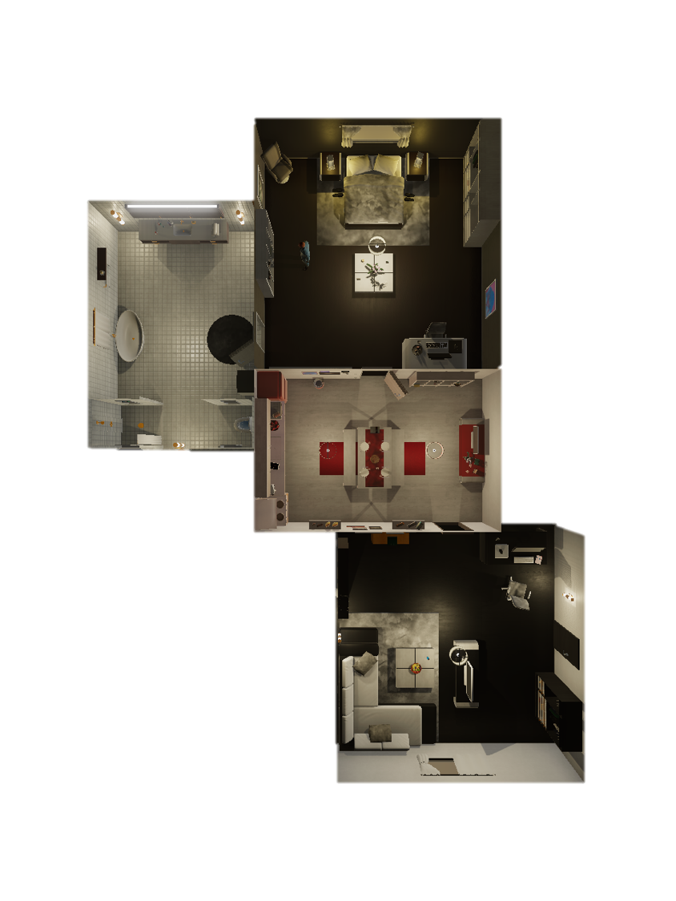
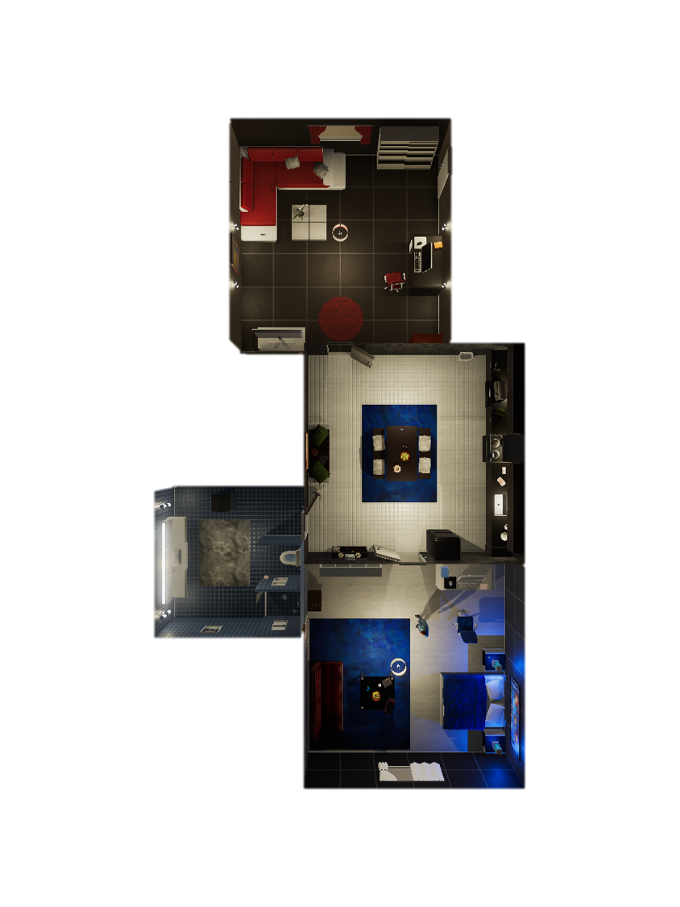
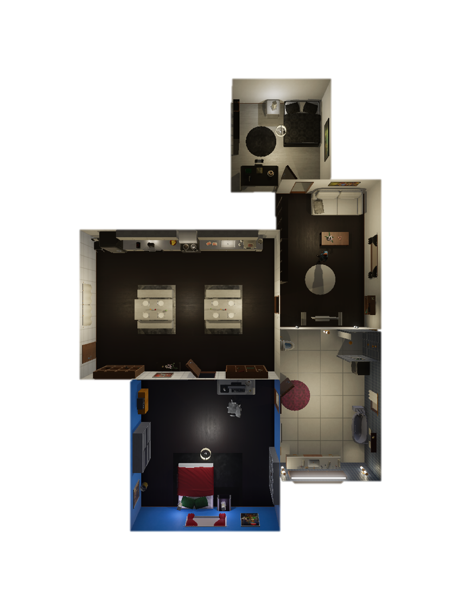
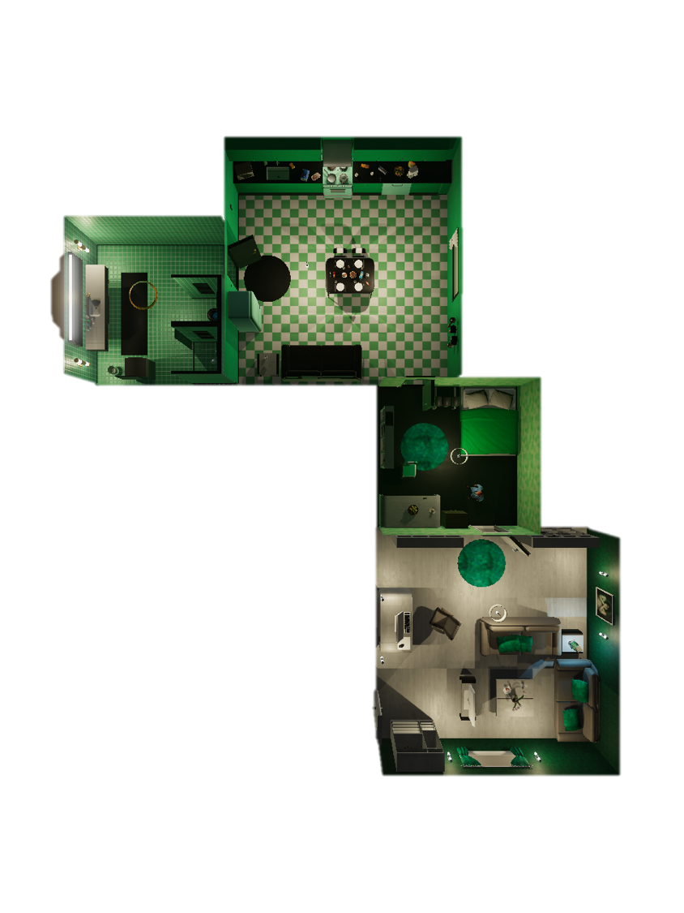
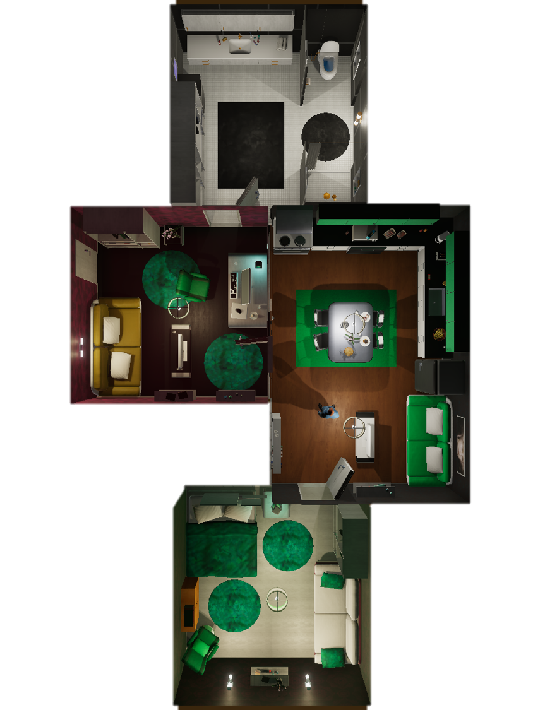
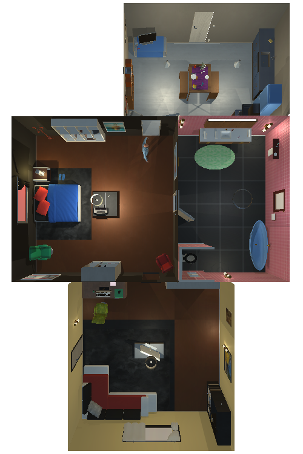
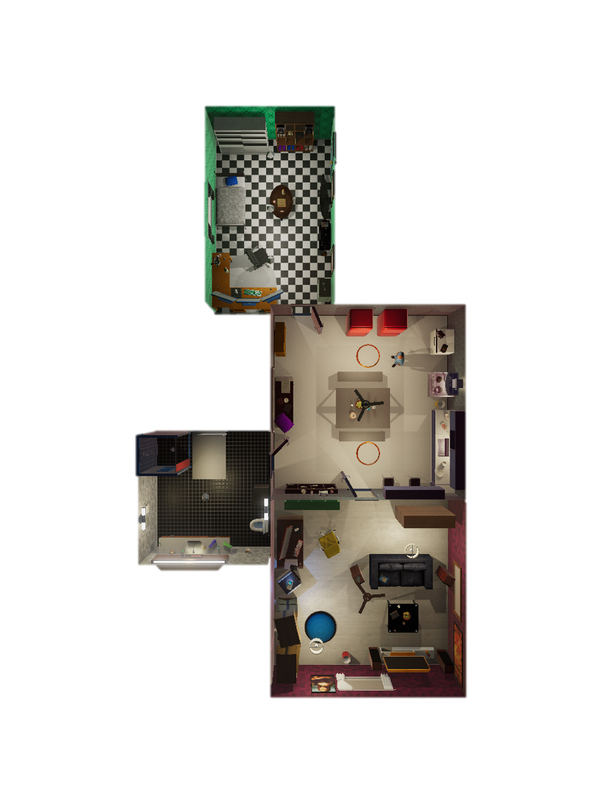

# Simulation
This directory contains the *Unity Simulator* and *Evolving Graph* simulator API's. Remember that in order to run the Unity Simulator, you need to download and execute the appropiate unity executable. The *Evolving Graph* simulator does not require any unity executable. 

VirtualHome simulation works through 2 components:

- Programs: A sequence of actions representing an activity. Each action is formed by one verb and up to 2 object arguments (e.g. `[PutBack] <glass> (1) <table> (1)`).
- Environment: the environment where the programs will be executed. Each environment is represented as a graph, where correspond to objects with properties and `(e.g. CLOSED/ON)` and edges contain relationships between objects. 

Following, we provide documentation of the Environment settings and Actions currently supported. 

## Contents
- Programs
	- Preconditions
	- Actions
		- Supported in Unity Simulator
- Environment
    - Relations
    - Object Properties
    - Object States


# Programs
The programs allow executing activities in VirtualHome a program is composed by a sequence of instructions of the form `[Action_name] <Object_name> (Object_id)`.

For example:

```python
program = ['[Walk] <chair> (1)', '[Sit] <chair> (1)']
```

Programs can also have preconditions, describing how should the environment be in order to execute the program. Following we show documentation of the preconditions and actions supported.

## Preconditions
List of preconditions that can be specified in the programs. The preconditions specify constrains in the environment where the program will be executed.
### Unary preconditions
- `object` is_on: `object` in `on` state.
- `object` is_off: `object` in `off` state.
- `object` plugged: `object` in `plugged_in` state.
- `object` unplugged: `object` in `plugged_out` state.
- `object` open: `object` in `open` state.
- `object` closed: `object` in `closed` state.
- `object` occupied: `object` has too many `on` edges to sit or lie in it.
- `object` free: `object` has no objects attached with `on` edges.
- `character` sit: `character` must have state `sitting` and edge `on` between character and an `object`.
- `character` lying: `character` must have state `lying` and edge `on` between character and an `object`.

### Binary preconditions
- `object` in `character`: `character` is wearing `object`. Edge `on` between `object` and `character`.  
- `object1` in `object2`:  Edge `on` between `object1` and `object2`.
- `object1` inside `object2`: edge `inside` between `object1` and `object2`.
- `object1` location `room`: edge `inside` between `object1` and `room`.
- `object1` facing `object2`: edge `inside` between `object1` and `object2`
- `object1` atreach `object`: edge `inside` between `close` and `object2`
 
## Actions

### TemplateExecutor
- script: action object1 object2
- Pre-condition: 
- Post-condition:
    - remove/add undirected edges:
    - remove/add directed edges:
    - state changes:

___
    
### FindExecutor
- script: find `object`
- cases:
	- `object` on `character` -> execute find
	- `object` with properties BODY_PART -> execute find
	- `character` is sitting or lying -> execute find
	- `character` close `object` -> execute find
	- other -> execute walk first, then find
- Pre-condition:
	- exists edge `character` close `object` or for each edge `character` close `object2` exists edge `object2` close `object`  # i.e., either character must be 
		close to `object` or `object` must be close to every object the character is currenty close to
- Post-condition:
    - add undirected edges: `character` close `object`
	- remove directed edges: `character` faces `object`


### WalkExecutor
- script: walk `object`
- Pre-condition: 
	- `character` state is not sitting
- Post-condition:
    - remove undirected edges: `character` inside `any_node`, `character` close `any_node`, `character` faces `any_node`
    - add undirected edges: `character` close to object_contain(`object`)
	- add undirected edges: `character` close to object with properties BODY_PART
	- add undirected edges: `character` close to object in hands
    - add directed edges: `character` inside room_of(`object`)
    - add undirected edges: `character` close `object`
	- add undirected edges: `character` close all objects on `object`

### RunExecutor
- script: Run `object`
- Pre-condition: 
	- `character` state is not sitting
- Post-condition:
    - remove undirected edges: `character` inside `any_node`, `character` close `any_node`, `character` faces `any_node`
    - add undirected edges: `character` close to object_contain(`object`)
	- add undirected edges: `character` close to object with properties BODY_PART
	- add undirected edges: `character` close to object in hands
    - add directed edges: `character` inside room_of(`object`)
    - add undirected edges: `character` close `object`
	- add undirected edges: `character` close all objects on `object`

### SitExecutor
- script: sit `object`
- Pre-condition: 
	- exists edge `character` close `object`
	- `character` state is not sitting
	- `object` property is sittable
	- number of objects on `object` must be less than: 'couch': 4, 'bed': 4, 'chair': 1, 'loveseat': 2, 'sofa': 4, 'toilet': 1, 'pianobench': 2, 'bench': 2	
- Post-condition: 
    - add directed edges: `character` on `object`
    - state changes: `character` sitting
    - add 

### StandUpExecutor
- script: standup
- Pre-condition: 
	- `character` state is sitting
- Post-condition: 
	- `character` remove state sitting

### GrabExecutor
- script: grab `object`
- Pre-condition: 
	- `object` property is grabbable except water
	- exists edge `character` close `object`
	- no edge `object` inside `object2` unless `object2` is room or `object2` state is open // Cannot grab an object inside other one, unless it is open
	- no edge `character` holds_rh `any_object` or no edge `character` holds_lh `any_object`  // character has at least one free hand 
- Post-condition: 
    - remove directed and undirected edges: `object` any_relation `any_node`
    - add directed edges: `character` holds_rh `object` or `character` holds_lh `object`
	- add undirected edges: `character` close `object`
    - add undirected edges: `character` close `object2` if there was edge `object` on `object2` (or `object` inside `object2`)  // do not know if this is necessary

### OpenExecutor
- script: open `object`
- Pre-condition: 
	- `object` property is openable and `object` state is closed
	- exists edge `character` close `object`
	- no edge `character` holds_rh `any_object` or no edge `character` holds_lh `any_object`  // character has at least one free hand 
- Post-condition:
    - state changes: `object` state is open

### CloseExecutor (shared with OpenExecutor)
- script: close `object`
- Pre-condition: 
	- `object` property is openable and `object` state is open
	- exists edge `character` close `object`
- Post-condition:
    - state changes: `object` state is closed
       
### PutBackExecutor
- script: putback `object1` `object2` // means put object on
- Pre-condition: 
	- exists edge `character` holds_lh `object1` or `character` holds_rh `object1`
	- exists edge `character` close `object2`
- Post-condition:
    - remove directed edges: `character` holds_lr `object1` or `character` holds_lr `object2`
    - add undirected edges: `character` close `object2`, `object1` close `object2`
    - add directed edges: `object1` on `object2`


### PutExecutor
- script: putback `object1` `object2` // means put object on
- Pre-condition: 
	- exists edge `character` holds_lh `object1` or `character` holds_rh `object1`
	- exists edge `character` close `object2`
- Post-condition:
    - remove directed edges: `character` holds_lr `object1` or `character` holds_lr `object2`
    - add undirected edges: `character` close `object2`, `object1` close `object2`
    - add directed edges: `object1` on `object2`

### PutInExecutor
- script: putin `object1` `object2`
- Pre-condition:
	- exists edge `character` holds_lh `object1` or `character` holds_rh `object1`
	- exists edge `character` close `object2`
	- `object2` property is not openable or `object2` state is open  // needs adjustment, now one can put something into any object (for openable we check open state); consider possibility of putting sugar in a cup
- Post-condition:
    - remove directed edges: `character` holds_lr `object1` or `character` holds_lr `object2`
    - add undirected edges: `character` close `object2`
    - add directed edges: `object1` inside `object2`

### PutExecutor
- script: putback `object1` `object2` // means put object on
- Pre-condition: 
	- exists edge `character` holds_lh `object1` or `character` holds_rh `object1`
	- exists edge `character` close `object2`
- Post-condition:
    - remove directed edges: `character` holds_lr `object1` or `character` holds_lr `object2`
    - add undirected edges: `character` close `object2`, `object1` close `object2`
    - add directed edges: `object1` on `object2`

### SwitchOnExecutor
- script: switchon `object`
- Pre-condition: 
	- `object` property is has_switch
	- `object` state is off
	- exists edge `character` close `object`
	- `object` must not be plugged_out
- Post-condition: 
    - state changes: `object` state is on

### SwitchOffExecutor
- script: switchoff `object`
- Pre-condition: 
	- `object` property is has_switch
	- `object` state is on
	- exists edge `character` close `object`
- Post-condition: 
    - state changes: `object` state is off

### DrinkExecutor
- script: drink `object`
- Pre-condition:
    - `object` property is drinkable or recipient
    - exists edge `character` holds_rh `object` or `character` holds_lh `object`

### TurnToExecutor
- script: TurnTo `object`
- Pre-condition:
	- exists edge `character` close `object`
- Post-condition:
	- remove directed edges: `character` faces anyobject
	- add directed edges: `character` faces `object`

### LookAtExecutor (shared with PointAtExecutor)
- script: LookAt `object`
- Pre-condition:
	- exists edge `character` facing `object`

### WipeExecutor
- script: Wipe `object`
- Pre-condition: 
	- `character` close `object`
	- exists edge `character` holds_rh `object` or `character` holds_lh `object`
- Post-condition:
	- state changes: `object` state is clean

### PutOnExecutor
- script: PutOn `object`
- Pre-condition:
	- exists edge `character` holds_rh `object` or `character` holds_lh `object`
	- `object` preperty is clothes
- Post-condition:
	- add directed edges: `object` on `character`
	- remove directed edges: `character` holds_rh `object` or `character` holds_lh `object`

### PutOffExecutor
- script: PutOff `object`
- Pre-condition:
	- exists edge `object` on `character`
	- `object` preperty is clothes
- Post-condition:
	- remove directed edges: `object` on `character`
	
### GreetExecutor
- script: Greet `object`
- Pre-condition:
	- `object` property is person

### DropExecutor
- script: Drop `object`
- Pre-condition:
	- exists edge `character` holds_rh `object` or `character` holds_lh `object`
- Post-condition:
	- remove direction edges: `character` holds_rh `object` or `character` holds_lh `object`
	- add directed edges: `object` inside room_of(`character`)

### ReadExecutor
- script: read `object`
- Pre-condition:
    - `object` property is readable
    - exists edge `character` holds_rh `object` or `character` holds_lh `object`

### TouchExecutor
- script: touch `object`
- Pre-condition:
	- exist edge `character` close `object`
	- no edge `object` inside `object2` unless `object2` is room or `object2` state is open // Cannot touch an object inside other one, unless it is open
	

### LieExecutor
- script: lie `object`
- Pre-condition: 
	- exists edge `character` close `object`
	- `character` state is not lying
	- `object` property is lieable
	- number of objects on `object` must be less than: 'couch': 2, 'bathtub': 2, 'bed': 3, 'loveseat': 2, 'sofa': 2, 'bench': 1
- Post-condition: 
    - add directed edges: `character` on `object`
    - state changes: `character` lying


### PourExecutor
- script: pour `object1` `object2`
- Pre-condition:
	- exist edge `character` close `object2`
	- exist edge `character` holds_rh `object1` or `character` holds_lh `object1`
	- `object1` property is pourable or drinkable
	- `object2` property is recipient
- Post-condition:
	- add directed edges: `object1` inside `object2`


### TypeExecutor
- script: type `object`
- Pre-condition:
	- exist edge `character` close `object`
	- `object` property is has_switch


### WatchExecutor
- script: watch `object`
- Pre-condition:
    - room of `character` is room of `object`
    - `object` is not inside a closed object
	- only television, computer, laptop is allowed to be watched
	- `character` face `object` if character sitting


### MoveExecutor
- script: push/pull/move `object`
- Pre-condition: 
	- `object` property is movable (exception: push button)
	- exists edge `character` close `object`
	- no edge `object` inside `object2` unless `object2` is room or `object2` state is open // Cannot move an object inside other one, unless it is open
	- no edge `character` holds_rh `any_object` or no edge `character` holds_lh `any_object`  // character has at least one free hand

### WashExecutor (shared with RinseExecutor and ScrubExecutor)
- script: wash `object`
- Pre-condition:
	- exist edge `character` close `object`
- Post-condition:
	- `object` state not dirty
	- `object` state clean


### SqueezeExecutor
- script: squeeze `object`
- Pre-condition:
	- `object` property is clothes
	- no edge `character` holds_rh `any_object` or no edge `character` holds_lh `any_object`
	- exist edge `character` close `object`


### PlugInExecutor
- script: plugin `object`
- Pre-condition: 
	- `object` property is has_plug
	- `object` state is plugged_out
	- exists edge `character` close `object`
	- no edge `character` holds_rh `any_object` or no edge `character` holds_lh `any_object`  // character has at least one free hand 

- Post-condition: 
    - state changes: `object` state is plugged_in

### PlugOutExecutor
- script: plugout `object`
- Pre-condition: 
	- `object` property is has_plug
	- `object` state is plugged_in
	- exists edge `character` close `object`
	- no edge `character` holds_rh `any_object` or no edge `character` holds_lh `any_object`  // character has at least one free hand 
- Post-condition: 
    - state changes: `object` state is plugged_out


### CutExecutor
- script: cut `object`
- Pre-condition:
	- `object` property is eatable
	- `object` property is cuttable
	- no edge `character` holds_rh `any_object` or no edge `character` holds_lh `any_object`
	- exist edge `character` close `object`
	- exist edge `chatectore` holds_rh `any_object` with 'knife' in name or no edge `character` holds_lh `any_object` with 'knife' in name


### EatExecutor
- script: eat `object`
- Pre-condition:
	- `object` property is eatable
	- exist edge `character` close `object`


### SleepExecutor
- script: sleep
- Pre-condition:
	- `character` is lying or sitting


### WakeUpExecutor
- script: wakeup
- Pre-condition:
	- `character` is lying or sitting


## Supported in Unity Simulator
Here is the list with Executors currently supported in the Unity Simulator. The rest are only supported in Graph Evolve simulator.

Action Executor | Supported Unity
------------ | -------------
FindExecutor  | :white_check_mark:
WalkExecutor | :white_check_mark:
RunExecutor | :white_check_mark:
SitExecutor | :white_check_mark:
StandUpExecutor | :white_check_mark:
GrabExecutor | :white_check_mark:
OpenExecutor | :white_check_mark:
CloseExecutor | :white_check_mark:
PutBackExecutor | :white_check_mark:
PutExecutor | :white_check_mark:
PutInExecutor | :white_check_mark:
SwitchOnExecutor | :white_check_mark:
SwitchOffExecutor | :white_check_mark:
DrinkExecutor | :white_check_mark:
TurnToExecutor | :white_check_mark:
LookAtExecutor | :white_check_mark:
WipeExecutor |
PutOnExecutor |
PutOffExecutor |
GreetExecutor |
DropExecutor |
ReadExecutor |
TouchExecutor | :white_check_mark:
LieExecutor |
PourExecutor |
TypeExecutor |
WatchExecutor |
MoveExecutor |
WashExecutor |
SqueezeExecutor |
PlugInExecutor |
PlugOutExecutor |
CutExecutor |
EatExecutor |
SleepExecutor |
WakeUpExecutor |


# Environment
VirtualHome is composed of 7 scenes where activities can be executed. Each scene is encoded in a `.json` file containing a node for every object and edges between them representing relationships. Each environment can be updated by modifying the corresponding `.json` file. 

The files representing each apartment can be found in [example_graphs](../example_graphs/) as `TestScene{apt_id}_graph.json`. Each graph has a Trimmed version, which is used for the Evolving Graph simulator.

You can check in the [demo](../demo/unity_demo.ipynb) examples on how to read and update graphs.

| Scene 1   | Scene 2   | Scene 3   | Scene 4   | Scene 5   | Scene 6   | Scene 7  |
| ------------- | ------------- | ------------- | ------------- | ------------- | ------------- |------------- |
|  | | | | | | 

You can check here the list of supported node states, edge relations and object properties in the graphs representing the environment. 

*Note that this documentation holds for both Unity Simulator and Evolving Graph*.

## Relations
Possible relations (edge labels) are:

- **on**
- **inside**
- **between**  _used for door object, if door is between kitchen and livingroom, we have edges `door` between `livingroom` and `door` between `kitchen`_
- **close** edge `object1` close `object2` denotes that the distance between center of `object1` (`object2`) to the bounding 
box of `object2` (`object1`) is < 1.5 units (~meters)  
- **facing** there is an edge `object1` facing `object2` if `object2` is lookable, is visible from `object1`, and the 
distance between the centers is < 5 units (~meters). If `object1` is a sofa or a chair
 it should also be turned towards `object2`
- **holds_rh**  _edge `character` holds_rh `object` is used to indicate that character holds an object in its right hand_
- **holds_lh**  _analogue of holds_rh for left hand_

## Object Properties

- surfaces
- grabbable
- sittable
- lieable
- hangable
- drinkable
- eatable
- recipient
- cuttable
- pourable
- can_open
- has_switch
- readable
- lookable
- containers
- clothes
- person
- body_part
- cover_object
- has_plug
- has_paper
- movable
- cream

## Object States

- closed
- open
- on
- off
- sitting
- dirty
- clean
- lying
- plugged_in
- plugged_out


